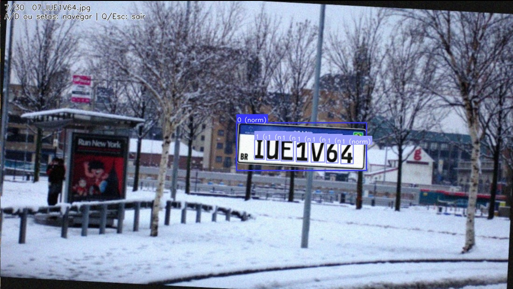

# Gerador Sintetico de Placas Mercosul para YOLO

Projeto em Python para gerar imagens sinteticas de placas Mercosul com anotacoes no formato YOLO.

## Combinacao aleatoria de placas

Cada amostra gera um texto de placa com combinacao aleatoria no formato `AAA0A00`, sorteando letras e numeros a cada imagem.


## O que o projeto gera

- Imagens `.jpg` com placas inseridas em cenarios variados.
- Rotulos `.txt` no padrao YOLO:
  - `0` = placa
  - `1` = caractere
- Opcionalmente, estrutura de `train/valid/test` com `dataset.yaml`.

## Instalacao

```bash
pip install -r requirements.txt
```

## Uso rapido

```bash
python Gerador_Placa.py --num-images 500 --output-dir dataset --clean
```

Exemplo com split:

```bash
python Gerador_Placa.py --split-train 700 --split-valid 200 --split-test 100 --output-dir dataset --clean
```

## Demonstracao final

Imagem de exemplo do resultado final gerado:


